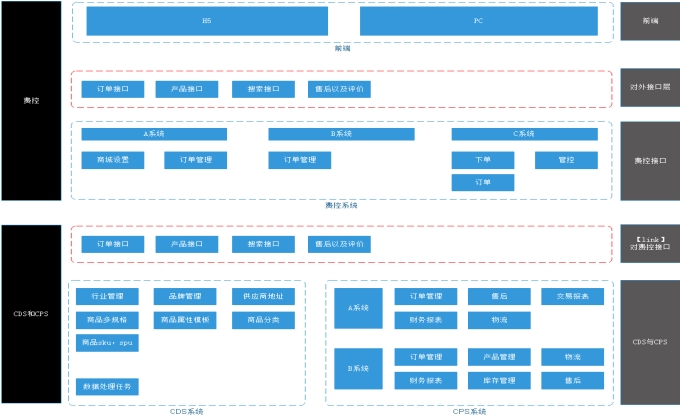
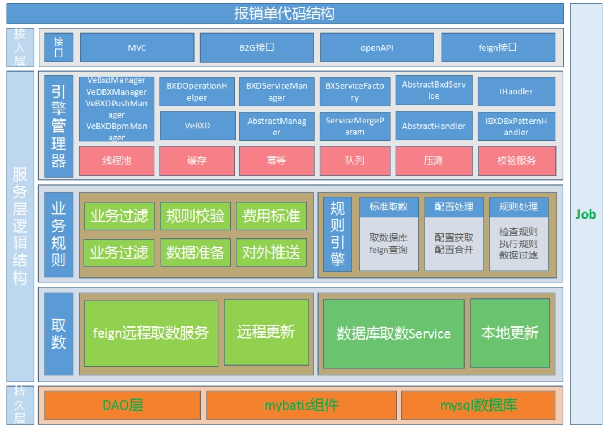
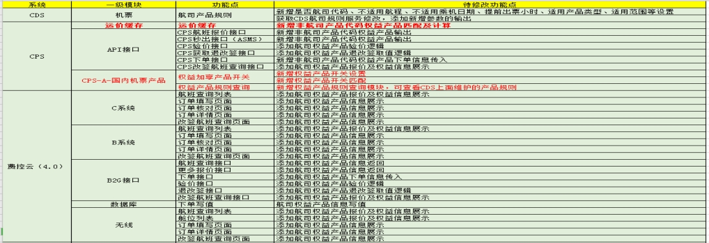

**详细设计规范**

|   |   |
|---|---|
|文件状态：  草稿               修改             正式发布|所属项目编号：项目立项时的编号|
|版    本：|
|撰 写 人:|
|完成日期：2025-12-30|
|发布日期：2025-12-30|

|   |   |   |   |   |   |
|---|---|---|---|---|---|
|序号|类别|版本|作者|时间|备注|
|1|新增|1.0|张程|2025-12-26|新增|

# **目录**

[目录](#_Toc24521)

[开发须知](#_Toc28123)

[1.非功能性要求](#_Toc5384)

[可靠性](#_Toc14531)

[高性能](#_Toc6525)

[可维护性](#_Toc3203)

[安全性](#_Toc18693)

[2.详细设计评审要求](#_Toc4910)

[1. 术语定义](#_Toc13396)

[2. 功能性需求描述](#_Toc5616)

[2.1. 需求概述](#_Toc5663)

[2.1.1. 需求1](#_Toc2556)

[2.1.2. 需求2](#_Toc26328)

[2.2. 业务全景图](#_Toc9692)

[3. 功能详细设计](#_Toc11065)

[3.1. 功能点1](#_Toc19025)

[3.1.1. 功能内容](#_Toc15404)

[3.1.2. 实现逻辑](#_Toc8997)

[3.1.3. 异常处置](#_Toc31433)

[3.2. 功能点2](#_Toc18335)

[3.2.1. 功能内容](#_Toc14730)

[3.2.2. 实现逻辑](#_Toc8052)

[3.2.3. 异常处置](#_Toc11239)

[4. 技术实现设计](#_Toc14444)

[4.1. 系统结构设计](#_Toc30704)

[4.2. 接口及核心类设计](#_Toc23068)

[4.3. 与前端的交互](#_Toc8612)

[4.4. 与第三方的交互](#_Toc20566)

[4.4.1. 需要调用的第三方接口](#_Toc1557)

[4.4.2. 向外界提供的接口](#_Toc27205)

[5. 关键技术点](#_Toc3228)

[5.1. 并发编程](#_Toc23380)

[5.2. 事务控制](#_Toc9890)

[5.2.1 数据库局部事务](#_Toc21577)

[5.2.2 分布式事务](#_Toc15055)

[5.3. Job使用](#_Toc7742)

[5.4. 权限控制](#_Toc16031)

[5.5. Redis使用](#_Toc3678)

[5.6. 敏感信息处理](#_Toc6572)

[5.7. 错误码使用](#_Toc8336)

[5.8. 异动日志](#_Toc2091)

[5.9. 大数据量问题](#_Toc14454)

[5.10. 缓存的使用](#_Toc7791)

[5.11. MQ的使用](#_Toc17259)

[5.12. 重试机制使用](#_Toc23921)

[6. 数据库设计](#_Toc2915)

[6.1. 数据库表设计](#_Toc2221)

[6.2. 数据库访问模块设计](#_Toc18908)

[6.3. 数据流向图](#_Toc12247)

[7. WBS](#_Toc17215)

[附录1 接口定义明细](#_Toc13101)

[1. 接口1](#_Toc13921)

[2. 接口2](#_Toc32632)

  

# **开发须知**

详细设计是在充分理解需求的基础上，进行设计文档的编写，设计文档应充分说明复杂功能、核心功能关键实现方法、步骤、路径，应体现设计者对于需求的理解，以及知道如何实现，

设计文档也是指导实现者如何实现的参考指南。详细设计不仅要关注功能性需求的设计，同时也应该包含非功能性需求的设计，而我们往往容易忽略非功能性需求的设计，因此，这里特意予以强调。

## **1.非功能性要求**

### **可靠性**

可靠性指软件在异常情况下或在被非法、非常规使用时维持自身功能的能力。主要体现在容错和健壮性这两个方面。

　　容错指软件发生故障时仍保持正常运行的能力。它保证软件能在异常情况下正常运行，并在内部完成故障的修复工作。修复完成后，软件需要继续或从头开始执行异常位置的操作。

　　健壮性是保护软件不受非正常使用方式或非法输入影响的能力。具备该能力后，不论怎样的使用方式，软件都能准确迁移至系统定义的状态。

例如：

● 分布式系统在发生通信异常时会先暂时切断连接，等问题修复完成后再重新连接，恢复软件的运行；  
　　● 系统缺陷率每1,000小时最多发生1次故障；  
　　● 因软件系统的失效而造成无法完成业务的概率要小于5‰。                    

### **高性能**

性能是系统或组件在给定的限制条件（如速度、精度或内存使用）内完成其指定功能的程度。性能表现是衡量软件质量的重要指标，在需求分析和系统设计阶段就必须充分考虑性能因素。性能指标主要包括响应时间、并发数、资源使用率等。简单地说，性能需求体现了系统如何“多快好省”地实现客户的功能需求。

例如：

　● 响应时间：在95％的情况下，一般时段响应时间不超过1.5秒，高峰时段不超过4秒；在网络畅通时，电子地图刷新时间不超过10秒；  
　　● 并发数：系统可以同时满足10,000个用户请求；  
　　● 资源使用率：CPU占用率<=50%，内存占用率<=50%。

### **可维护性**

功能在应对需求变更时，实现业务扩展时，能否比较方便地满足复杂多变的需求，一般要在设计上，要进行灵活的设计，以实现业务上的持续迭代，保证一定的可维护性。

例如：

● 从接到修改请求后，对于普通修改应在1~2天内完成；  
　　● 对于评估后为重大需求或设计修改应在1周内完成；  
　　● 90%的BUG修改时间不超过1个工作日，其他不超过2个工作日。

### **安全性**

安全性指产品消除潜在风险的能力和对风险的承受能力。包括保密性、可靠性和完整性三个子特性。保密性指数据不能被授权用户以外的任何人访问的能力。可靠性指授权用户可以不受阻止的访问数据、与其它软件的兼容的能力和产品的强壮度。完整性指按预期目标完成任务的能力。

　　一般分为程序安全、系统安全、数据安全。程序安全指开发的程序是否是安全的，程序上有没有安全的漏洞，例如Web开发中服务器代码没有对输入的参数进行验证，从而导致客户端机器人轻易的获取数据。系统安全指系统整体的安全，例如安全的粒度，未经授权的用户是否可以轻易的访问非法的数据等。数据安全是对数据的保护，数据库中数据有没有做审核，用户之间是否会共享数据等。

 例如：

● 严格权限访问控制，用户在经过身份认证后，只能访问其权限范围内的数据，只能进行其权限范围内的操作；

　　● 提供运行日志管理及安全审计功能，可追踪系统的历史使用情况；

● 能经受来自互联网的一般性恶意攻击。如病毒（包括木马）攻击、口令猜测攻击、黑客入侵等；

  

# 1. **术语定义**

|   |   |   |
|---|---|---|
|缩写|名称|备注|
||||
||||
||||

# 2. **功能性****需求****描述**

来自于产品或实施的需求描述，只谈需求，不谈任何设计实现。

## 2.1. **需求概述**

### 2.1.1. **需求1**

列表查询、详情各分区（头部、基础信息、补录行程、补助、费用合计、分摊、备注、按钮）及编号化需求项

### 2.1.2. **需求2**

## 2.2. **业务全景图**

# 3. **功能详细设计**

## 3.1. **功能点****1**

### 3.1.1. **功能内容**

此项目里面有哪些功能要做的，需要自己分解出来，在这个地方必需写清楚

### 3.1.2. **实现逻辑**

**包括逻辑描述，业务流程图、序列图等**

### 3.1.3. **异常处置**

**在此描述对异常的处理方案。例如在审批后调用feign接口失败，此事应该怎么进行反冲处理。**

## 3.2. **功能点****2**

### 3.2.1. **功能内容**

### 3.2.2. **实现逻辑**

**包括逻辑描述，业务流程图、序列图等**

### 3.2.3. **异常处置**

**在此描述对异常的处理方案。例如在审批后调用feign接口失败，此事应该怎么进行反冲处理。**

# 4. **技术实现设计**

## 4.1. **系统结构设计**

根据任务，将系统分成多个模块。从一级、二级、三级的角度上进行模块级别的划分，在二级或三级模块下挂接任务。

描述模块间的交互以及接口定义。

 

例图1

 

例图2

## 4.2. **接口及核心类设计**

用接口定义系统的宏观框架，用核心类类图表示系统的主体结构。

命名空间明细。

例如：VeBxdManager，VeDBXManager，VeBXDPushManager，VeBXDBpmManager，分别为报销单服务管理器，报销前置管理器，报销数据推送管理器，报销审批对接管理器。

## 4.3. **与前端的交互**

描述与前端的那些控件交互；交互中前端将调用后端的什么服务。 

列举清单列表。

## 4.4. **与第三方的交互**

### 4.4.1. **需要调用的第三方接口**

接口定义，入参描述，返回值描述，应用场景

### 4.4.2. **向外界提供的接口**

接口定义，入参描述，返回值描述，逻辑描述。

# 5. **关键技术点**

系统涉及到的一些关键技术点的实现，例如并发编程、事务控制、Job使用、权限控制、Redis使用、敏感信息处理、错误码使用、异动日志、大数据量问题、缓存的使用、MQ的使用。

## 5.1. **并发编程**

在关键场景需要考虑是否需要用到并发编程，例如：异步处理、多线程处理等

Ø 并发编程要考虑是否需要使用分布式锁。

Ø 并发编程要使用线程安全的对象。

## 5.2. **事务控制**

### **5.2.1** **数据库局部事务**

对于需要满足数据库本地事务要求的关键业务代码，需要加@Transactional注解来实现声明式事务

### **5.2.2 分布式事务**

对于需要实现分布式事务的重要场景，需要考虑实现最终一致性，一般推荐通过补偿的机制进行重试，实现最终一致性。

## 5.3. **Job使用**

对于本次功能的开发，是否涉及Job的开发，Job的开发需要考虑，任务执行周期，扫描数据的时间、业务条件，避免大数据集的查询，避免OOM。

## 5.4. **权限控制**

包括数据访问权限等（例如，A公司的员工不能访问B公司的数据）

## 5.5. **Redis使用**

对于Redis的使用，应考虑设计满足规范的Redis前缀、合理的数据结构，应考虑对Redis资源的消耗，是否占用Redis过多内存(应量化评估)，是否为大key出现慢查询。

## 5.6. **敏感信息处理**

对于敏感信息应遵守公司安全规范，加密存储、脱敏显示。

## 5.7. **错误码使用**

Ø 做国际化的第一步就是整理错误代码，错误代码对应的文本信息可以翻译成各种语言。

Ø 不同系统之间，通过错误代码映射，实现错误信息提示统一化。

## 5.8. **异动日志**

Ø 必须要注意那些地方是要记录异动日志的，在任务安排中就要考虑到，作为编码任务的一部分。

## 5.9. **大数据量问题**

Ø 必须要注意新设计的表未来数据量的增长问题，数据是否有生命周期管理，是否有清理机制，避免占用过多的磁盘空间，导致存储资源耗尽，避免大表的慢查询

## 5.10. **缓存的使用**

Ø 在适合的场景应该使用缓存，同时应充分考虑到缓存的实时刷新问题；

## 5.11. **MQ的使用**

Ø 在适合的场景应该使用MQ，需要遵守MQ使用规范，充分考虑消息消费的幂等性；

## 5.12. **重试机制使用**

Ø 关键业务场景，应保证绝对的数据一致性，应提供重试机制，并且保证幂等性；

# 6. **数据库设计**

## 6.1. **数据库表设计**

E-R关系图

表定义（如果是已有表，只列出新增字段和主键字段）

## 6.2. **数据库访问模块设计**

DAO、service和实体类

## 6.3. **数据****流向****图**

# 7. **WBS**

在此插入拆解后的任务WBS清单。

例如：

 

# **附录****1** **接口定义明细，****主要是给前端的接口**

## 1. **接口****1**

在此放置接口的定义，包括接口名、入参、出参等。

## 2. **接口2**