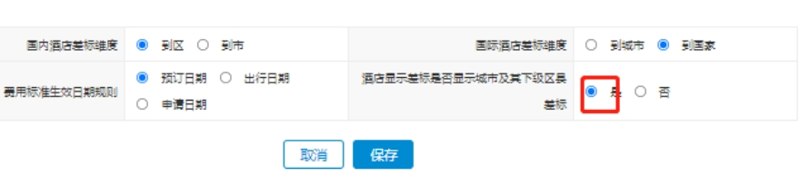
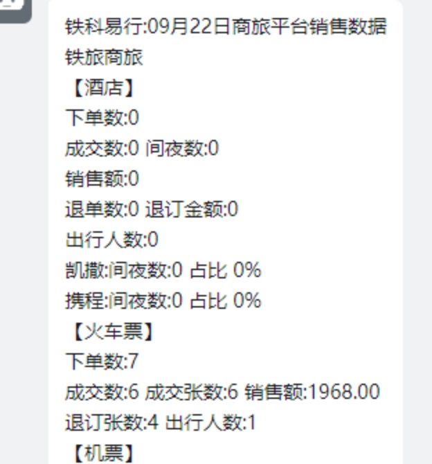
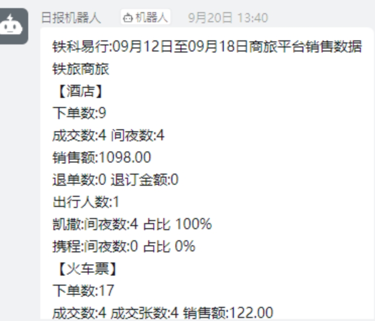

# **费控前端测试报告模板**

## 1.1  **酒店查询时，选择城市后，差标显示应该展示该城市所有区县的差旅标准（天津重庆差旅标准合并展示问题）**

|   |   |
|---|---|
|功能名称|酒店查询时，选择城市后，差标显示应该展示该城市所有区县的差旅标准（天津重庆差旅标准合并展示问题）|
|需求描述|**问题的原因：**弱网情况下，页面没有城市就不会传给接口城市，那么拿到的就是所有城市的差标，这也是标准版的逻辑  **优化的方式：**  1、没有获取到城市就不展示差标  2、酒店查询时，选择城市后，差标显示应该展示该城市所有区县的差旅标准|
|测试步骤|预定操作示例的酒店    酒店预定界面，选择天津，对应的差标城市，看差标界面展示是否为天津下所有的差标展示（天津-6 个中心城区、天津-宁区）|
|测试结果|R合  格           □不合格|
|备    注||
|测试截图|      |

## 1.2 **钉钉数据日报，展示了cps的 订单数据，实际是无需展示**

|        |                                                                            |
| ------ | -------------------------------------------------------------------------- |
| 功能名称   | 钉钉数据日报，展示了cps的 订单数据，实际是无需展示                                                |
| 需求描述   | 实际供应商只有携程和凯撒，但是cps也被统计在订单数据中                                               |
| 测试步骤   | 1、登录管理员账号，操作运营决策--》企业运营报表--》企业消费日报--》推送  2、查看钉钉日报信息是否存在cps的 订单数据统计展示 |
| 测试结果   | R合  格           □不合格                                                       |
| 备    注 |                                                                            |
| 测试截图   |                |